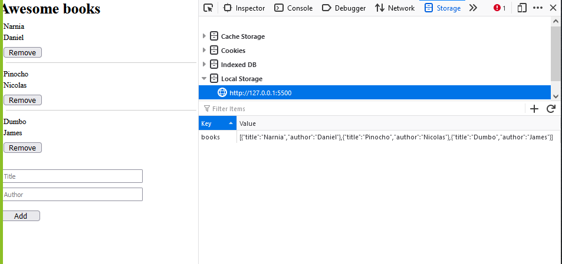

# Awesome Book Project

> In this project we as a team are working on creanting dynamic elements with JavaScript and using the browser localStorage to save the book date.

## Built with
* HTML - CSS
* JavaScript
* GIT/GITHUB

## Project View

## Live page
- checkout the project page: [Awesome-Book]()

## Authors

👤 **Daniel Ufeli** - GitHub: [@danielufeli](https://github.com/danielufeli) - Twitter: [@danielufeli](https://twitter.com/danielufeli) - LinkedIn: [Daniel](https://www.linkedin.com/in/danielcode/) 

**Eduardo Sancho Solano** - GitHub: [@eduardosancho](https://github.com/eduardosancho) - Twitter: [@sanchitobless](https://twitter.com/sanchitobless) - LinkedIn: [Eduardo](https://www.linkedin.com/in/eduardo-sancho-043641181/) 

👤**Andres Felipe Arroyave Naranjo** - GitHub: [@JohnFTitor](https://github.com/JohnFTitor) - Twitter: [@johnftitor](https://twitter.com/johnftitor) - LinkedIn: [Andres](https://www.linkedin.com/in/andresfelipe117/?locale=en_US) 

## 🤝 Contributing

Contributions, issues, and feature requests are welcome!
Feel free to check leave recommendation in [issues page](https://github.com/Nicolaswg/Awesome_Book_Project/issues)

